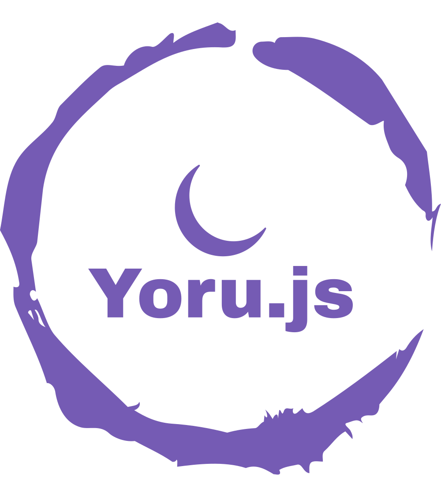

<h1 align="center"> Yoru.js </h1>

Yoru.js é um terminal personalizado que utiliza a tecnologia de [web container](https://webcontainers.io) para oferecer uma experiência de desktop em um ambiente de linha de comando na web. Com Yoru.js, você pode executar códigos JavaScript diretamente no navegador em um ambiente de linha de comando intuitivo e fácil de usar.

## Funcionalidades

* Execução de códigos JavaScript diretamente no navegador.

* Uso da tecnologia de web container para oferecer uma experiência de desktop em um ambiente de linha de comando na web

* Execução do terminal localmente no seu computador, sem a necessidade de uma conexão com a internet.

* Executar aplicativos Node.js e baixar pacotes.

## Instalação

Para utilizar o Yoru.js, você precisa apenas abrir o terminal em seu navegador, clicando no link a seguir: [Yoru.js](https://yoru-js.vercel.app).

## Como usar

Após abrir o terminal Yoru.js, você pode começar a executar códigos JavaScript imediatamente. Basta digitar `node` para entra no terminal interativo ou executar os códigos disponíveis na pasta `utils` ou `api-express`. O terminal exibirá a saída correspondente na tela.

## Tecnologia de web container

Yoru.js utiliza a tecnologia de web container para oferecer uma experiência de desktop em um ambiente de linha de comando na web. Isso significa que você pode executar o terminal localmente no seu computador, sem a necessidade de uma conexão com a internet.

A tecnologia de web container permite que Yoru.js seja especialmente útil para aplicativos web que exigem desempenho de desktop, como editores de código, IDEs e outras ferramentas de desenvolvimento.

## Desenvolvimento de Aplicações
Yoru.js tem como objetivo fornecer uma plataforma de terminal flexível e extensível para o desenvolvimento de aplicativos JavaScript na web. Embora atualmente esteja em desenvolvimento, planejamos adicionar a funcionalidade de desenvolvimento de aplicativos em uma futura atualização.

Como exemplo de aplicação, você pode conferir o projeto de exemplo na pasta `api-express`. Para executar o projeto de exemplo, basta entrar na pasta do projeto e executar o comando `npm install` para instalar todas as dependências e depois `npm run start` para executar o servidor.

Esteja ciente de que, embora esses recursos não estejam disponíveis no momento, estamos trabalhando duro para tornar Yoru.js uma plataforma de desenvolvimento JavaScript completa e poderosa na web.

## Contribuindo

Se você deseja contribuir com o Yoru.js, sinta-se à vontade para fazer um fork do repositório e enviar um pull request com suas alterações. Agradecemos muito todas as contribuições da comunidade.

---- 

<small>
Gostou da Yoru.js? Deixe uma estrela no nosso repositório para nos ajudar a crescer e melhorar a plataforma! Também apreciamos feedback e contribuições de todos os tipos. Obrigado por usar Yoru.js!
<small>
